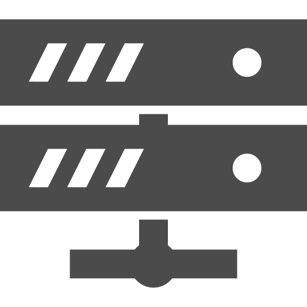

# mods

| Type | Name | S/C | Descr |
| :---: | --- | :---: | --- |
| Mods | [fabric-api](https://www.curseforge.com/minecraft/mc-mods/fabric-api) |   | Fabric Core API Library MODを動かす為の前提MOD |
| Mods | [ForgeConfigAPIPort](https://www.curseforge.com/minecraft/mc-mods/forge-config-api-port-fabric) |   |  以下のMODを動かす為の前提MOD - [`PuzzlesLib`](https://www.curseforge.com/minecraft/mc-mods/puzzles-lib) |
| Mods | [PuzzlesLib](https://www.curseforge.com/minecraft/mc-mods/puzzles-lib) |   |  以下のMODを動かす為の前提MOD - [`LeavesBeGone`](https://www.curseforge.com/minecraft/mc-mods/leaves-be-gone) |
| Mods | [Sodium](https://www.curseforge.com/minecraft/mc-mods/sodium) |   |  軽量化Mod - [Modrinth](https://modrinth.com/mod/sodium?version=1.21.8&loader=fabric) 参考 - https://goli-carft.com/minecraft-sodium-installation/ |
